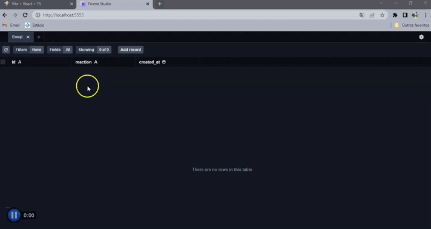

<h1 align="center">
  FEEDBACK - EMOJI 😀
</h1>

<p align="center">
 

  
</p>

## Tecnologias

- ReactJS
- Sass
- Typescript
- Axios
- React-Toastify
- NodeJS
- Express
- Prisma
- Sqlite

</br>

### Como rodar o projeto

### 🎲 Rodando o Back-End (servidor)

```bash
# Acesse a pasta do projeto no terminal/cmd
$ cd feedback-emoji

# Vá para a pasta backend
$ cd server

# Instale as dependências
$ yarn || npm i

# Execute a aplicação em modo de desenvolvimento
$ yarn dev || npm run dev

```

### 🎲 Rodando o Front-End

```bash

# Vá para a pasta web
$ cd web

# Instale as dependências
$ yarn || npm i

# Execute a aplicação em modo de desenvolvimento
$ yarn dev || npm run dev

```

</br>

<h1 align="center"> 
	Projeto
</h1>

<h1 align="center">
  
</h1>